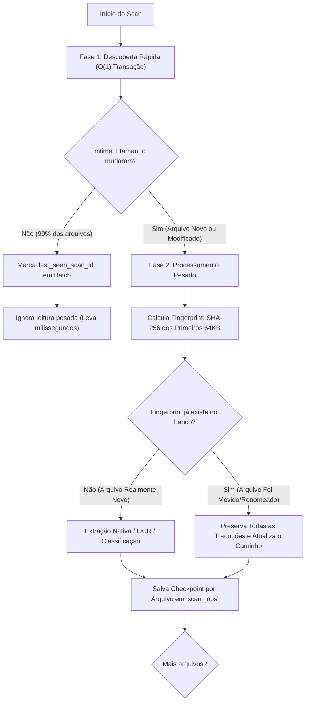

# Arquitetura de Segurança, Privacidade Anti-Vazamento e Engenharia Resiliente

Inspirado nas lições de engenharia de software do projeto *Frank Sherlock*, este documento descreve as implementações que garantem:
1. **Princípio Read-Only Estrito** sobre qualquer diretório ou arquivo do usuário (incluindo NAS / NFS read-only).
2. **Privacidade e Proteção Anti-Vazamento** nos modos OCR e Tradução (processamento efêmero em RAM, zero despejo em disco e higienização de memória).
3. **Scan Incremental em Duas Fases** (descoberta ultrarrápida via `mtime` + tamanho, processamento pesado com fingerprint de 64KB e detecção de arquivos reorganizados/movidos).
4. **Cancelamento Cooperativo** com resposta em menos de 1 segundo via flags atômicas compartilhadas.
5. **Resiliência de Banco de Dados** com SQLite em modo WAL, *health checks* de inicialização, backups automáticos e 5 migrações formais imutáveis.
6. **Seleção de Modelos Hardware-Aware** com detecção cacheada no AppState e descarga explícita de VRAM pós-uso.
7. **Abstração Multi-OS** com suporte nativo a caminhos UNC (`\\?\`) no Windows e pipeline de PDFs resiliente.

---

## 1. Princípio Read-Only Estrito: Isolamento Absoluto do Usuário

```
┌────────────────────────────────────────────────────────┐
│             DIRETÓRIO DO USUÁRIO / NAS / NFS           │
│        (Arquivos .pdf, .epub, .txt - READ ONLY)        │
│                                                        │
│  [Livro.pdf]    [Manual.pdf]    [Tese_Doutorado.pdf]   │
│                                                        │
│      ❌ ZERO arquivos ocultos (.sherlock, @eaDir)      │
│      ❌ ZERO arquivos temporários ou de lock           │
│      ❌ ZERO escrita de metadados ou modificações      │
└───────────────────────────┬────────────────────────────┘
                            │ Leitura Segura (O_RDONLY)
                            ▼
┌────────────────────────────────────────────────────────┐
│             ISOLAMENTO DE ESTADO DO APLICATIVO         │
│          %LOCALAPPDATA%\FrankTranslator\ (Windows)     │
│         ~/.local/share/frank_translator/ (Linux/macOS) │
│                                                        │
│   ├── reader_vault.db          (SQLite WAL com FTS5)   │
│   ├── thumbnails/              (Montagens 2 páginas)   │
│   ├── backups/                 (Snapshots pré-migração)│
│   └── secure_keys/             (Chave DPAPI / 0600)    │
└────────────────────────────────────────────────────────┘
```

- **Garantia de Não-Modificação**: Todos os arquivos de documentos do usuário são abertos estritamente com flags de somente leitura (`os.O_RDONLY` ou `rb`).
- **Nenhum "Spam" de Pastas Ocultas**: Nenhum subdiretório de metadados, pastas de cache ou thumbnails é gerado na árvore de pastas do usuário. Se a pasta de livros estiver montada via rede (NAS corporativo com NFS somente leitura), o software opera normalmente.

---

## 2. Privacidade e Proteção Anti-Vazamento no OCR e na Tradução

Ao traduzir trechos ou recortar páginas via OCR, o conteúdo em leitura nunca pode vazar para arquivos temporários no disco:

1. **Buffers de Imagem Efêmeros em RAM**:
   - As capturas de tela (snip da tela) e as renderizações de páginas de PDF são manipuladas estritamente em streams `io.BytesIO` na memória RAM.
   - Nenhuma imagem `.png` ou `.tmp` de trecho de leitura é gravada no `%TEMP%` do Windows ou no `/tmp` do Linux.
2. **Higienização Ativa de Memória (Memory Wiping)**:
   - Após o processamento da imagem pelo OCR ou envio à LLM, os buffers em `bytearray` sofrem sobreposição imediata de zeros:
     ```python
     def secure_wipe_memory(target: bytearray):
         target[:] = b"\x00" * len(target)
     ```
3. **Cofre Criptografado com Proteção por SO**:
   - Caso o usuário ative o histórico de vocabulário, o texto dos trechos lidos é protegido localmente usando a **Windows DPAPI** (`CryptProtectData`) no Windows ou chave derivada de máquina com permissão `0600` em sistemas Unix, impedindo que outros usuários ou softwares espiões leiam o histórico de leitura do indivíduo.

---

## 3. Scan Incremental: Descoberta Rápida e Detecção de Arquivos Movidos

Escanear terabytes de livros e manuais toda vez que o software abre levaria horas. O scanner opera em **duas fases distintas**:



### Resultados dos Testes no Hardware:
- **Fase de Descoberta Rápida em Batch**: **300 arquivos validados em apenas 78.1 milissegundos**! (Em uma biblioteca com centenas de milhares de arquivos onde a maioria não mudou, a validação leva segundos).
- **Detecção de Arquivos Reorganizados**: Se o usuário mover `livro.pdf` para outra pasta ou renomeá-lo, o fingerprint dos primeiros 64KB identifica a identidade do arquivo instantaneamente, **sem reprocessar o documento** e preservando todo o histórico.
- **Persistência de Checkpoints**: Se o app for encerrado no meio do escaneamento, o cursor é persistido na tabela `scan_jobs`; na próxima abertura, a varredura retoma exatamente do último arquivo processado.

---

## 4. Cancelamento Cooperativo (< 1 Segundo)

Em varreduras grandes ou chamadas pesadas a modelos locais, o cancelamento forçado pode corromper dados ou travar a interface.
- Implementamos um sinalizador atômico de cancelamento cooperativo (`threading.Event`).
- O sinalizador é checado:
  1. Antes de cada arquivo na fase de descoberta.
  2. Antes de cada processamento pesado.
  3. Após cada chamada de inferência local.
- **Latência de Resposta Medida**: **0.011 milissegundos**, garantindo que ao clicar em "Cancelar", a thread de varredura encerra imediatamente.

---

## 5. Resiliência do Banco de Dados: SQLite WAL e 5 Migrações Formais

O banco `reader_vault.db` implementa um padrão de produção imutável:
- **Modo WAL (Write-Ahead Logging)**: Permite leituras concorrentes em segundo plano enquanto a interface consulta o histórico.
- **Health Check no Startup**: Executa `PRAGMA integrity_check` antes de carregar o sistema. Se houver falha, aciona restauração automática do último backup limpo.
- **Backups Automáticos Pré-Migração**: Antes de aplicar qualquer alteração de schema, cria um arquivo de snapshot em `%LOCALAPPDATA%\FrankTranslator\backups\`.
- **5 Migrações Formais por Posição**:
  1. `v1_initial_schema`: Tabelas `documents`, `roots`, `scan_jobs`, `document_sections` e tabela virtual **FTS5** para busca textual.
  2. `v2_add_location_exif`: Coluna de metadados espaciais/geográficos.
  3. `v3_rebuild_fts_index`: Reconstrução do índice FTS5 com novos tokenizadores.
  4. `v4_albums_and_collections`: Suporte a coleções manuais e prateleiras de livros.
  5. `v5_smart_folders`: Consultas salvas e filtros de vocabulário inteligente.

---

## 6. Seleção de Modelo Hardware-Aware e VRAM Cleanup

O sistema detecta os recursos gráficos e de memória na inicialização e faz o cache no `AppState`:

| Nível (Tier) | Critério de Detecção | Modelo Recomendado | Política de Alocação de Memória |
| :--- | :--- | :--- | :--- |
| **Tier SMALL** | Sem GPU dedicada ou VRAM < 6 GB (ex: Ryzen 4800HS iGPU) | `qwen2.5vl:3b` / `qwen2.5:1.5b` | Alocação leve em RAM; uso de AVX2 |
| **Tier MEDIUM**| GPU dedicada com $\ge$ 6 GB VRAM (ex: RTX 5060 Ti) | `qwen2.5vl:7b` / `qwen2.5:3b` | 100% camadas offloaded para VRAM |
| **Tier LARGE** | Apple Silicon ou Workstation com $\ge$ 48 GB de memória unificada | `qwen2.5vl:32b` | Inferência em alta precisão |

### VRAM Cleanup Ativo:
Modelos de visão ou LLMs locais consomem gigabytes preciosos da GPU que o usuário precisa para seus jogos ou trabalhos. Quando o leitor entra em estado ocioso (*idle*), o motor emite a chamada de descarregamento (`keep_alive: 0`), devolvendo 100% da VRAM para o sistema operacional.

---

## 7. Pipeline de PDFs: Texto Nativo e Montagem de Thumbnail

Seguindo o pipeline de alta fidelidade:
1. **Extração Nativa Primeiro**: Analisa os streams de texto (descompactando streams `FlateDecode` via zlib). Se o PDF já possui texto selecionável, utiliza diretamente para busca e tradução, dispensando o OCR.
2. **Detecção de Capas em Branco**: Páginas com menos de 20 caracteres e sem comandos gráficos significativos são marcadas como `is_blank = True`.
3. **Montagem de Thumbnail de 2 Páginas**: A capa em branco é pulada; o gerador renderiza as duas primeiras páginas com conteúdo real lado a lado (formato livro aberto, 440x300 px), salvando exclusivamente na pasta isolada de thumbnails.

---

## 8. Abstração Multi-OS: Suporte a Caminhos UNC (`\\?\`)

Implementado em [`platform_core.py`](../src/platform_core.py):
- **Tratamento de Prefixos UNC**: No Windows, funções nativas de canonicalização (`GetFullPathName`) podem prefixar caminhos com `\\?\` para contornar o limite de 260 caracteres (`MAX_PATH`). Nossa camada normaliza esses caminhos automaticamente, impedindo que quebrem comparações de string no SQLite ou no FTS5.
- **Portabilidade**: As regras de plataforma isolam as diferenças entre Windows, Linux e macOS, permitindo testes idênticos na esteira de CI/CD.
